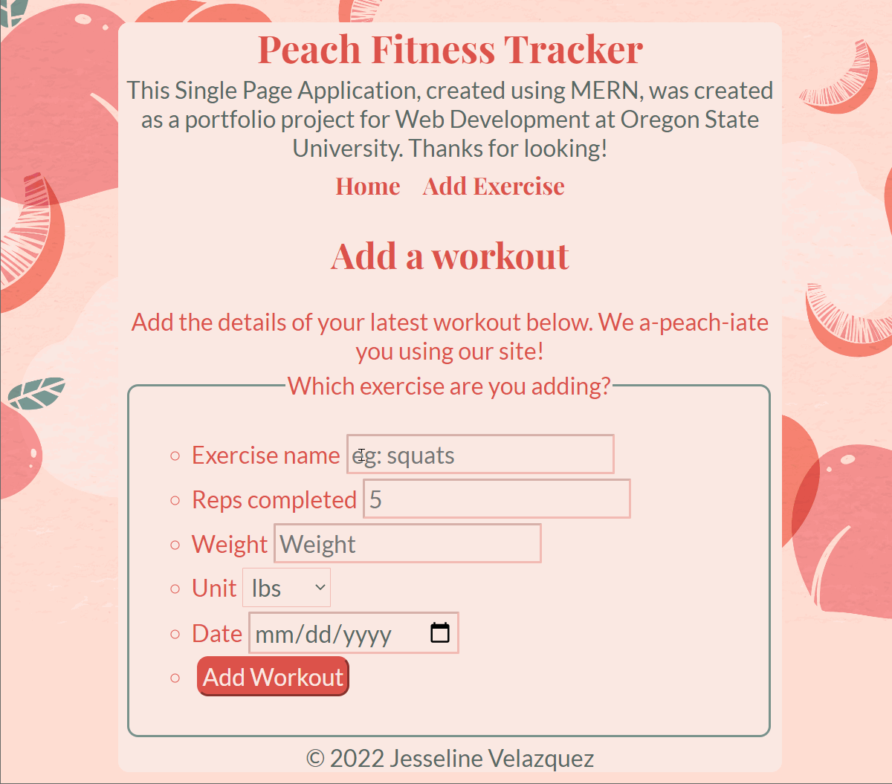

# Exercise-Mern

Peach Fitness Tracker is a Single Page Application, created using MERN was my portfolio project for Web Development.

Time spent: 8 hours spent in total

Required Features
The following required functionality is completed:

 User can add workouts.
 User can view workouts.
 User can edit workouts.
 User can delete workouts.

The following optional features are implemented:

The following features can be made to improve the app functionality:
- The addition of sorting options to the table component.
- Instead of the window alert, an alert that is integrated into the table.
- A confirmation before deleting the workout.
 
 
